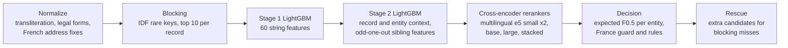

# Amazon ML Challenge 2026: Business Entity Resolution

Team **Inno8**: Drashtant Mevada, Jenil Gajera, Ramani Dwarkesh, Harsh Singh.

**Final public leaderboard score: 0.988642 (macro F0.5)**, up from 0.940 on our first upload, in a 72-hour challenge with 8,000+ teams.

## The problem

Three sources describe the same businesses with no shared IDs. Source 1 is a clean reference list; Sources 2 and 3 hold noisy copies (typos, abbreviations, transliterated Hindi and French, reordered or missing addresses) mixed with **decoys**: records built to look like a real business but that are not it. For every Source 1 business we list its true copies. Scoring is F0.5 per business, averaged, so a wrong merge costs about twice as much as a missed one.

The test set added a twist: **France**, a country that never appears in the training data.

## Approach



1. **Blocking**: rare name tokens, name pairs and name-by-address keys weighted by IDF, keeping the top 10 companies per record (about 11 candidates per Source 1 business, 98.1% of true pairs kept).
2. **Two LightGBM stages**: string similarities first, then context: how a record ranks against its other candidates and against the other copies of the same business ("odd one out" features that catch a copy whose house number or added word disagrees with its siblings).
3. **Cross-encoder rerankers**: `multilingual-e5` models fine-tuned to read a record and a candidate together. Two small ones were trained on an Apple M2 Mac, a base and a large one on a free Kaggle T4. A LightGBM stacker combines them with the stage 2 score on the uncertain pairs. This was the single biggest jump (0.974 to 0.982).
4. **Decision**: for each business, pick the set of matches that maximises expected F0.5, which lets a business with nothing assigned accept a less certain match while protecting businesses that already have matches.
5. **France without labels**: two models must agree; a type-word swap (Club vs Ecole at the same address) is treated as a decoy; trade suffixes (et Fils, Cie, Groupe) as noise; and French addresses are normalized so that "Hauts-de-France" vs "Nord", "N°56" vs "56" and "25BIS" vs "25 bis" stop hiding true matches. Each rule was checked with label-free fingerprints (decoys are written in lowercase and shift house numbers upward far more often than true copies) and hand review.
6. **Rescue**: extra candidate keys (names with spaces removed, typo-tolerant name keys, address-only keys) for records blocking missed, accepted only when the cross-encoders agree.

## Leaderboard journey

| Version | What changed | Public F0.5 |
|---|---|---|
| v1 | Blocking + one LightGBM | 0.940 |
| v2 | Second LightGBM stage | 0.950 |
| v3 | Transliteration map, legal-form and house-number features | 0.968 |
| v6 | Learned decoy-word veto | 0.974 |
| v11 | First cross-encoder stack, expected-F0.5 decision | 0.982 |
| v15 | Cross-encoder ensemble, rescue, France audit rules | 0.986784 |
| v17 | French address normalization fix | 0.9871 |
| v20 | e5-large in the stack, high-confidence recheck, name-key rescue, France checks | 0.988549 |
| v21 | Extra validated rescues | **0.988642** |

Every change was validated first on a held-out slice of training entities with a test-weighted F0.5 (the test has about 1.9 times more unmatched records than train). Late in the challenge the validation gains matched the leaderboard closely (v21: +0.00008 predicted, +0.000093 measured).

## What did not work

- Training with exact duplicate copies of decoys: it taught the model "a perfect twin is a decoy" and inflated validation scores.
- Self-training and quantile normalization to adapt to France.
- A 95-feature stacker, per-entity match caps, larger blocking depth, and a fifth reranker (bge-reranker-v2-m3) on top of four e5 models.
- Address-less records whose name is shared by many businesses (chain branches) remain the largest unsolved loss: nothing in the data tells the branches apart.

## Repository layout

```
src/                  pipeline: normalize, blocking, features, LightGBM stages,
                      cross-encoders, stacker, decision rules, France rules, rescue
src/final_steps/      the exact scripts behind the final submission, in order
research/             GPU training kit, Kaggle runner, France re-run and helper tools
docs/methodology.md   full methodology, experiments and numbers
docs/reproduction.md  step-by-step run order
requirements.txt      pinned dependencies
```

The competition data is not included. Place the challenge's `student_resource/` folder at the repository root to run the pipeline (see `docs/reproduction.md`).

## Models and compute

| Model | Licence | Parameters | Trained on |
|---|---|---|---|
| LightGBM (4 models) | MIT | small | Apple M2 Mac |
| intfloat/multilingual-e5-small (x2) | MIT | 118M | Apple M2 Mac (MPS) |
| intfloat/multilingual-e5-base | MIT | 278M | Kaggle T4 (free tier) |
| intfloat/multilingual-e5-large | MIT | 560M | Kaggle T4 (free tier) |

No external data, lookups or APIs were used; only the provided training data.
