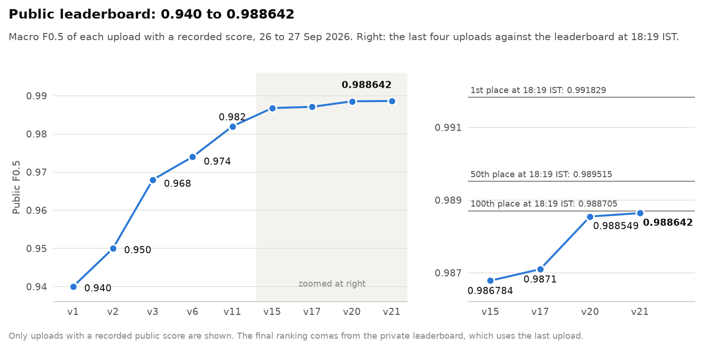
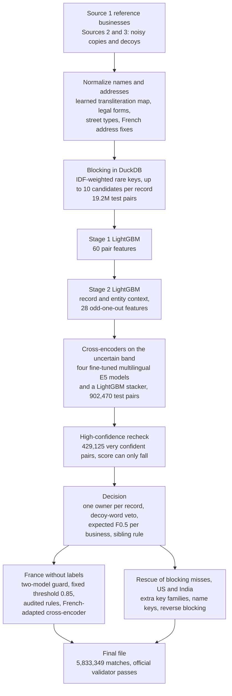
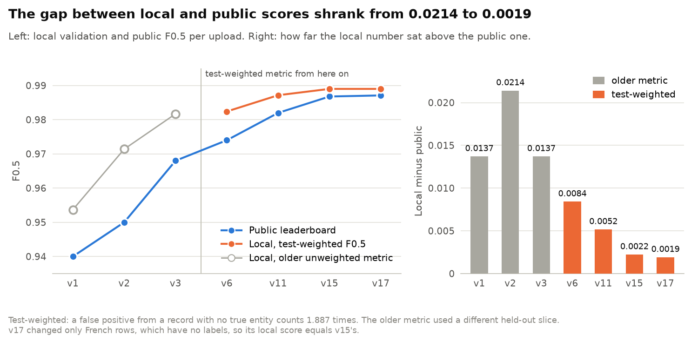
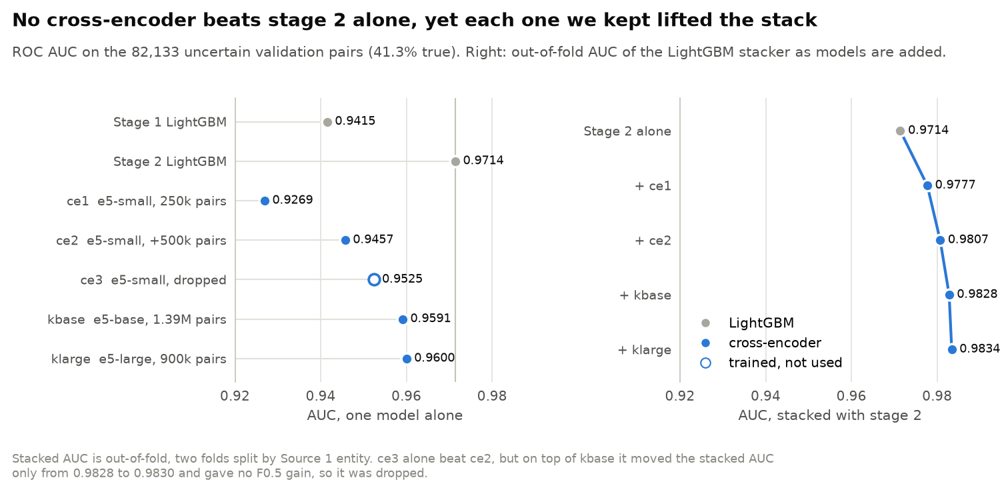

# Amazon ML Challenge 2026: Business Entity Resolution

**Team Inno8's solution for linking about 10 million noisy, multilingual business records to 1.7 million reference businesses, with planted decoys and a test-only country that has no labels. Final public macro F0.5: 0.988642.**

| Final public F0.5 | Field | Start | Compute |
| --- | --- | --- | --- |
| **0.988642** | 8,269 teams on the leaderboard (27 Sep, 18:19 IST snapshot) | First commit 28 hours into the 72-hour window | One Apple M2 laptop (16 GB) and free Kaggle T4 and P100 GPUs |

We went from **0.940** on our first full-scale upload to **0.988642** on the last one, in about 44 hours of work. The final score sits just below the 100th-placed score (0.988705) on the 18:19 IST leaderboard. The final standing is decided on the private leaderboard, which uses the last upload.



**Read more:** [documentation index](docs/README.md) · [full methodology](docs/methodology.md) · [how to reproduce](docs/reproduction.md) · [leaderboard journey](docs/10-leaderboard-journey.md)

---

## The problem

Three sources describe the same businesses in the US, India and France, and they share no identifiers.

- **Source 1** is a clean reference list: one row per business.
- **Sources 2 and 3** hold noisy copies of those businesses: transliterated names, swapped legal forms, reordered or missing address parts, typos.
- Mixed in with the copies are **decoys**: records that copy a real business and change one detail (the house number, the legal form, one added word). They match nothing, and they are the main source of wrong merges.

For every Source 1 business we list the Source 2 and Source 3 records that describe it. The score is F0.5 per Source 1 business, averaged over all businesses (singletons included):

```
F0.5 = 1.25 * TP / (1.25 * TP + 0.25 * FN + FP)
```

A wrong merge enters the denominator with weight 1 and a missed match with weight 0.25, so precision is worth much more than recall.

| | Train | Test |
| --- | --- | --- |
| Source 1 businesses | 2,206,821 | 1,732,544 |
| Source 2 records | 5,034,616 | 4,887,273 |
| Source 3 records | 5,285,603 | 5,082,316 |
| Countries | US, India | US, India, **France** |
| Labelled matches | 7,638,365 pairs | none |
| Share of Source 2/3 records that match nothing | 26.0% | about 39.8% (estimated) |

A few short illustrative examples of what the models have to get right:

| Case | Source 1 (reference) | Source 2/3 record | Same business? |
| --- | --- | --- | --- |
| Transliterated name | Al Tech Technologies | al tek teknaljis piraivet limitet | yes |
| House-number decoy | (same name), 1781 hamilton st | toledo womens health, 1788 hamilton st | no |
| Legal-form decoy | Soutien Amicale SAS, 2 Rue Hans Christian Andersen | Soutien Amicale SNC, 9 Rue Hans Christian Andersen | no |
| French address format | 56 Avenue de Villeneuve, Saint-Nazaire, Pays de la Loire | N°56 AVENUE DE VILLENEUVE, SAINT-NAZAIRE, Pays de la Loire | same address |

Four facts about the data drove the design:

1. **Scale.** Comparing every pair is impossible, so blocking sets both the runtime and the recall ceiling.
2. **One owner per record.** No Source 2/3 record in the ground truth belongs to more than one business, so we resolve from the record side as an assignment problem and never need clustering.
3. **Test is more decoy-heavy than train.** Test has 1.887 times as many unmatched records per business. A validation metric that ignores this rewards the wrong changes.
4. **France appears only in test.** 259,452 of the 1,732,544 test businesses (15%) and 1,434,993 test records come from a country with no labels, a different language and a different address format.

More in [1. The problem and the data](docs/01-problem-and-data.md).

---

## Architecture



| Step | What it does | On test | Deep dive |
| --- | --- | --- | --- |
| Normalize | Transliterates non-Latin scripts and maps words back to English with a learned 521-entry dictionary; canonicalizes legal forms, DBA prefixes, leetspeak, street types and state names; four extra fixes for French addresses | 1,732,544 businesses, 9,969,589 records | [02](docs/02-blocking.md) |
| Blocking | IDF-weighted rare keys (name and address words, word pairs, spaceless names, name x address cross keys), top 10 per record, score-ratio pruning | 19,225,118 pairs | [02](docs/02-blocking.md) |
| Stage 1 | LightGBM on 60 pair features (RapidFuzz similarities, house numbers, legal-form clash, blocking score) | every candidate pair | [03](docs/03-lightgbm-stages.md) |
| Stage 2 | LightGBM with record and entity context and 28 odd-one-out features; for France an older model acts as a guard | every candidate pair | [03](docs/03-lightgbm-stages.md) |
| Cross-encoders | Four fine-tuned multilingual E5 models read record and candidate together; a LightGBM stacker combines them with the stage 1 and 2 scores | 902,470 uncertain pairs | [04](docs/04-cross-encoders.md) |
| Recheck | Two E5-small models and a small stacker recheck very confident US and Indian pairs (0.99 < p <= 0.999); the score can only fall | 429,125 pairs | [04](docs/04-cross-encoders.md) |
| Decision | Best candidate per record, decoy-word veto, expected-F0.5 selection per business, house-number sibling rule | expected-F0.5 selection kept 4,963,564 of 5,143,313 US and Indian assignments (v15 build) | [05](docs/05-decision-rules.md) |
| France | Two-model guard, fixed 0.85 threshold, audited removal and addition rules, address fix and re-run, French-adapted cross-encoder | 259,452 businesses | [06](docs/06-france.md) |
| Rescue | Four searches for records blocking missed, each accepted by a small model | 12,451 + 3,169 + 2,491 US and Indian records added | [07](docs/07-rescue.md) |

---

## Key ideas

**1. Resolve from the record side.** Every Source 2/3 record picks at most one Source 1 owner, so the one-owner property holds by construction and there is no pairwise clustering to get wrong. A business's matches are simply the records that chose it. See [5. Decision rules](docs/05-decision-rules.md).

**2. Spend on blocking recall.** A true pair that blocking drops can never be predicted. Name-by-address cross keys, spaceless names and a transliteration map learned from the training pairs raised the share of true training pairs kept from 94.45% to 98.2%; score-ratio pruning then cut the train candidates from 101,866,356 to 17,769,228 pairs (1.73 per record) for about 0.0004 of recall, ending at 98.13%. The transliteration map alone raised exact core-name agreement for transliterated Indian names from 15.3% to 89.5%. All of it runs in DuckDB on a 16 GB laptop. See [2. Blocking](docs/02-blocking.md).

**3. Look at the siblings, not just the pair.** Stage 2 sees the other records that point at the same business and asks whether this record is the odd one out: a house number shifted by an offset decoys use, an extra word no sibling carries, a new suffix. On the uncertain validation pairs it lifts ranking AUC from 0.9415 (stage 1) to 0.9714. We also found and removed a leak here: synthetic exact-duplicate decoys taught the model "has a twin, so it is a decoy", which looked like +0.003 locally and was -0.0017 when measured cleanly. See [3. The two LightGBM stages](docs/03-lightgbm-stages.md).

**4. Use transformers only where they matter.** Four fine-tuned multilingual E5 cross-encoders score only the 902,470 test pairs where stage 2 is unsure, not all 19.2M candidates. None of them beats stage 2 alone, but they are wrong on different pairs, and the stacked AUC climbs from 0.9714 to 0.9834. They were our largest late gain: the upload that introduced the first stack, together with the odd-one-out stage 2 and expected-F0.5 selection, moved the leaderboard from 0.974 to 0.982. See [4. Cross-encoders](docs/04-cross-encoders.md).

**5. Decide per business, not with one global threshold.** For each business we treat the records that chose it as independent Bernoulli variables and keep the top k that maximise its expected F0.5. A learned decoy-word veto (65 Indian and 27 US words, such as `enterprises` or `holdings`, that decoys add to real names) blocks a common false-merge pattern; the upload that introduced it gained +0.006. See [5. Decision rules](docs/05-decision-rules.md).

**6. Handle France without a single label.** A French match needs two stage 2 models to agree and must clear a fixed 0.85 threshold, and the cross-encoder stack can only lower a French score. Rules were checked with label-free fingerprints measured on train (true copies are written in lowercase 0.2% of the time, decoys 2.5%) and with hand-read samples. A French address fix changed 1,233,001 of 1,694,445 French test addresses, and a French-adapted cross-encoder removed 922 type-word-swap decoys (20 of 20 random removals read as decoys). See [6. France](docs/06-france.md).

**7. Rescue what blocking missed.** Records that end up unassigned get a second, independent search with different keys (glued or split words, typos in rare words, name-only keys for address-less records, blocking from the Source 1 side). Each pass has its own small acceptance model, fitted and thresholded on the validation slice. Together they added 12,451, 3,169 and 2,491 US and Indian test records in three rounds. See [7. Rescue](docs/07-rescue.md).

**8. Build a local metric the leaderboard agrees with.** Test has 1.887 times as many unmatched records per business as train, so a false positive from a record that matches nothing counts 1.887 times on our held-out slice of 110,565 US and Indian businesses. Before this, validation said 0.9817 when the leaderboard said 0.968. By the end, a change predicted at +0.00008 moved the leaderboard by +0.000093. See [8. Validation](docs/08-validation.md).

---

## Results

### Leaderboard journey

"Local" is test-weighted macro F0.5 on the 110,565 held-out US and Indian businesses. Rows without a public score have no recorded leaderboard result.

| Build | Main change | Local | Public F0.5 | Public change |
| --- | --- | --- | --- | --- |
| v1 | Full-scale blocking and one LightGBM | 0.9537 * | 0.940 | first upload |
| v2 | Cross and spaceless blocking keys, relative features, stage 2 | 0.9714 * | 0.950 | +0.010 |
| v3 | Transliteration map, legal-form clash, house-number distance | 0.9817 * | 0.968 | +0.018 |
| v6 + veto | Learned decoy-word veto | 0.98241 | 0.974 | +0.006 |
| v10 | Odd-one-out stage 2, sibling rule, France guard, French exact-address additions | 0.98470 | | |
| v11 | First cross-encoder (ce1) stack, expected-F0.5 selection | 0.98716 | 0.982 | +0.008 |
| v12 | Second E5-small cross-encoder (ce2) | 0.98777 | | |
| v13 | France audit rules (no effect on US and India) | 0.98777 | | |
| v14 | Rescue of blocking misses | 0.98847 | | |
| v15 | E5-base cross-encoder (kbase) from a Kaggle T4 | 0.98901 | 0.986784 | +0.004784 |
| v17 | French address fix and French re-run (France only) | 0.98901 | 0.9871 | +0.000316 |
| v19 | E5-large (klarge) as a fourth cross-encoder, high-confidence recheck, France push | +0.00013, +0.0001 | | |
| v20 | Name-key rescue | +0.00017 (held-out half) | 0.988549 | +0.001449 |
| **v21 (final)** | hc and reverse rescue, 24 French empty-business fills | +0.000075 (held-out half) | **0.988642** | +0.000093 |

\* v1 to v3 were scored with an older, unweighted metric on a different held-out slice, so they are not comparable with the rows below them. From v19 on, each local number is the gain of that change measured on its own.

### Local validation tracked the leaderboard



The reweighted metric is what made local work trustworthy. The gap between local and public shrank to 0.0022 at v15, and the late increments lined up: the v21 change was predicted at +0.00008 and scored +0.000093. At v11 the remaining local loss was mostly recall: fixing blocking misses alone would have regained 0.0061 and fixing true pairs scored below the decision line 0.0073, against 0.002 for all false positives. That is why the late work went into rescue.

### Cross-encoders

AUC on the 82,133 uncertain validation pairs (41.3% true). The stacked AUC is out of fold, two folds split by Source 1 business.

| Model | Base model | Training pairs | Hardware | AUC alone | Stack AUC after adding it | Local F0.5 gain |
| --- | --- | --- | --- | --- | --- | --- |
| stage 1 | LightGBM | 7,175,385 | Apple M2 CPU | 0.9415 | | |
| stage 2 | LightGBM | validation slice, out of fold | Apple M2 CPU | 0.9714 | 0.9714 | |
| ce1 | multilingual-e5-small | 250,000 | Apple M2 GPU (MPS) | 0.9269 | 0.9777 | +0.00246 (with expected-F0.5 selection) |
| ce2 | ce1, trained further | 500,000 more | Apple M2 GPU (MPS) | 0.9457 | 0.9807 | +0.00061 |
| kbase | multilingual-e5-base | 1,392,272 | Kaggle T4 | 0.9591 | 0.9828 | +0.00054 |
| klarge | multilingual-e5-large | 900,000 | Kaggle T4 | 0.9600 | 0.9834 | +0.00013 |

Two more were trained and dropped. A third E5-small model (ce3, 642,272 pairs) scored 0.9525 alone but moved the stacked AUC only from 0.9828 to 0.9830 on top of kbase and gave no F0.5 gain. `BAAI/bge-reranker-v2-m3`, fine-tuned on a Kaggle P100, scored 0.98841 locally as a fifth input against 0.98844 without it, so the final file uses four.



### The final file

| | v21 (final) |
| --- | --- |
| Matched Source 2/3 records | 5,833,349 of 9,969,589 |
| Source 1 businesses left empty | 99,991 of 1,732,544 |
| Candidate pairs (exactly the pairs the final models scored) | 19,691,692 |
| Candidates per business | mean 11.37 (US 9.59, India 11.81, France 14.51), median 10 |
| Official validator | passes; every match is in the candidate file |

---

## What did not work

| Idea | What happened |
| --- | --- |
| Exact-duplicate decoy copies in stage 2 training | A leak: in the augmented data only decoys had a perfect twin. +0.003 locally, -0.0017 once measured on data with no synthetic rows. Removed. |
| Longer candidate lists | The unpruned top 10 had almost six times the pairs (101,866,356 against 17,769,228 on train) for about 0.0004 more recall. |
| Per-country quantile normalization of scores | No gain. |
| Self-training on confident predictions | No gain. |
| A 95-feature stacker | +0.00004 once the cross-encoders were in; not worth the complexity. |
| Third E5-small and fifth (bge) cross-encoders | Stacked AUC 0.9828 to 0.9830 for ce3; 0.98841 with bge against 0.98844 without. |
| Re-tuning the decision settings on a grid | No held-out gain of at least +0.00005, so the defaults stayed. |
| Broader French change sets | A 3,952-pair removal set and a 62-pair empty-business fill failed their audits. |
| "Orphan copies" as the cause of the leaderboard gap | Rejected: the address-less rate of test records matches decoys, not copies. The reweighted metric closed the gap instead. |

The largest unsolved loss is address-less records whose name is shared by many businesses (chain branches): nothing in the data tells the branches apart. The full list, with the evidence for each decision, is in the [experiment log](docs/09-experiment-log.md).

---

## Repository map

```
.
├── README.md
├── requirements.txt      pinned dependencies (Python 3.12)
├── src/                  the main pipeline, one script per step
│   └── final_steps/      the chain that builds the final v21 file, and the gates behind each late change
├── research/             GPU training kit, Kaggle runner, France re-run, submission tools, figure script
├── docs/                 deep dives 01 to 10, full methodology, reproduction guide
└── assets/               charts used in the README and docs
```

| Area | Files |
| --- | --- |
| Config and normalization | `src/config.py`, `src/normalize.py`, `src/learn_translit.py`, `src/build_normalized.py` |
| Blocking | `src/block_candidates.py`, `src/evaluate_blocking.py` |
| Stage 1 | `src/build_features.py`, `src/train_matcher.py` |
| Word lists and veto | `src/learn_decoy_words.py`, `src/decoy_families.py`, `src/decoy_veto.py` |
| Stage 2 | `src/odd_features.py`, `src/build_odd_features.py`, `src/train_stage2.py` |
| Cross-encoders and stacker | `src/cross_encoder.py`, `src/build_ce_pairs.py`, `src/train_cross_encoder.py`, `src/score_cross_encoder.py`, `src/train_stacker.py` |
| Decision and France rules | `src/predict_submission.py`, `src/expected_f.py`, `src/address_rules.py`, `src/france_rules.py` |
| Rescue | `src/rescue_candidates.py`, `src/score_rescue.py`, `src/train_rescue.py` |
| Packaging | `src/package_submission.py` |
| Final chain | `src/final_steps/` (stack, recheck, assemble, france_rerun, france_push, rescue_extra, france_fill, kaggle); run order in [src/final_steps/README.md](src/final_steps/README.md) |
| Research tools | `research/gpu_kit/`, `research/kaggle/`, `research/france_rerun/`, `research/tools/`, `research/make_figures.py`; see [research/README.md](research/README.md) |

The remaining scripts in `src/` (`prepare_data.py`, `train_lightgbm.py`, `candidate_*_v2.py`, `diagnose_*.py`, `inspect_*.py` and similar) are the baseline and diagnostics from the team's first morning (26 Sep). They are not part of the final run order.

---

## How to reproduce

The competition data is not included in this repository. You need the challenge's `student_resource` folder (with `dataset/train`, `dataset/test` and `utils/validate_submission.py`).

```bash
python3.12 -m venv .venv
source .venv/bin/activate
pip install -r requirements.txt
export AMAZON_ML_DATA_ROOT=/path/to/student_resource
```

You need 16 GB of RAM, at least 25 GB of free disk, an Apple Silicon or CUDA GPU for the E5-small cross-encoders, and a CUDA GPU (a free Kaggle T4 is enough) for E5-base and E5-large. Keep DuckDB at the pinned 1.5.5: the validation split is `hash(source 1 id) % 20 = 0` with DuckDB's hash.

The run order, in short:

1. Normalization and blocking: `learn_translit.py`, `build_normalized.py`, `block_candidates.py train|test`.
2. Stage 1: `build_features.py train|test`, `train_matcher.py`, `predict_submission.py stage1`.
3. Word lists and the France guard: `learn_decoy_words.py`, `decoy_families.py`, `train_stage2.py`.
4. Stage 2: `build_odd_features.py train|test`, `train_stage2.py`.
5. Cross-encoders: `build_ce_pairs.py`, `train_cross_encoder.py`, `score_cross_encoder.py`, then `train_stacker.py`.
6. Decision, rescue and output: a first assignment with `predict_submission.py`, the rescue scripts, then `predict_submission.py 0.85`.
7. French re-run with the fixed address normalization, filtered against the earlier French rows.
8. Final chain: `bash src/final_steps/assemble/build_v22.sh`. The script stacks five cross-encoders by default; removing the two `kbge` files from its input lists rebuilds v21 exactly from the saved scores and change sets.

Every command, input and output is in [docs/reproduction.md](docs/reproduction.md) and [src/final_steps/README.md](src/final_steps/README.md). Known limits: GPU training is not bit-for-bit deterministic, so rebuilt cross-encoder scores differ slightly, and the French re-run used an older blocking query whose tie-breaking was not repeatable (the current `block_candidates.py` fixes this). The reproduction guide also lists the steps that read files saved from an earlier run instead of rebuilding them.

---

## Models and licences

| Component | Model | Licence | Size |
| --- | --- | --- | --- |
| Stage 1 | LightGBM, 60 features, 1,000 trees of 127 leaves | MIT | tree model |
| Stage 2 | LightGBM, 55 features, 400 trees of 63 leaves | MIT | tree model |
| France guard | earlier stage 2 LightGBM, 27 features | MIT | tree model |
| Cross-encoder stacker, recheck stacker, rescue acceptance model | LightGBM, 300 trees of 15 leaves | MIT | tree models |
| Name-key, hc and reverse rescue models | LightGBM | MIT | tree models |
| ce1, ce2, French-adapted cross-encoder | `intfloat/multilingual-e5-small`, fine-tuned | MIT | 118M parameters |
| kbase | `intfloat/multilingual-e5-base`, fine-tuned | MIT | 278M parameters |
| klarge | `intfloat/multilingual-e5-large`, fine-tuned | MIT | about 560M parameters |
| kbge (trained, not in the final file) | `BAAI/bge-reranker-v2-m3`, fine-tuned | Apache 2.0 | about 568M parameters |

Libraries: anyascii (ISC), LightGBM (MIT), RapidFuzz (MIT), DuckDB (MIT), PyTorch (BSD-3), transformers (Apache 2.0), plus numpy, pandas, pyarrow and scikit-learn. Exact versions are pinned in [requirements.txt](requirements.txt).

Only the provided challenge data was used: no external databases, business registries, APIs, geocoding or internet data. The only outside artefacts are the public pretrained weights above, fine-tuned on pairs from the training split. The French-adapted cross-encoder was trained further on French test pairs whose labels come from our own scores and rules, never from ground truth.

---

## Hardware

| Machine | Used for | Notable timings |
| --- | --- | --- |
| Apple M2 laptop, 16 GB RAM | Everything except kbase, klarge and kbge: DuckDB blocking with capped memory and spill, all LightGBM models, ce1, ce2 and the French-adapted cross-encoder on the M2 GPU (MPS) | ce1: 250,000 pairs in 4,013 s; ce2: 500,000 pairs in 7,324 s; one E5-small model scores the 902,470 test band pairs in about 21 minutes; French-adapted cross-encoder: 100,000 pairs in 1,631 s |
| Free Kaggle notebook, NVIDIA T4 (14.56 GiB usable) | kbase (E5-base) and klarge (E5-large with frozen word embeddings, batch 32) | kbase: 1,392,272 pairs, 10,878 steps at 245 pairs/s; test band scored in 468 s |
| Free Kaggle notebook, NVIDIA P100 | kbge (bge-reranker-v2-m3), not used in the final file | |

No paid compute and no hosted inference services.

---

## Team

Team **Inno8**:

- Drashtant Mevada (team leader)
- Jenil Gajera
- Ramani Dwarkesh
- Harsh Singh

The challenge ran from 25 Sep 2026 00:00 to 27 Sep 2026 23:59 IST. Our first commit landed on 26 Sep at 03:41, and the final upload was scored at 23:36 on 27 Sep.
