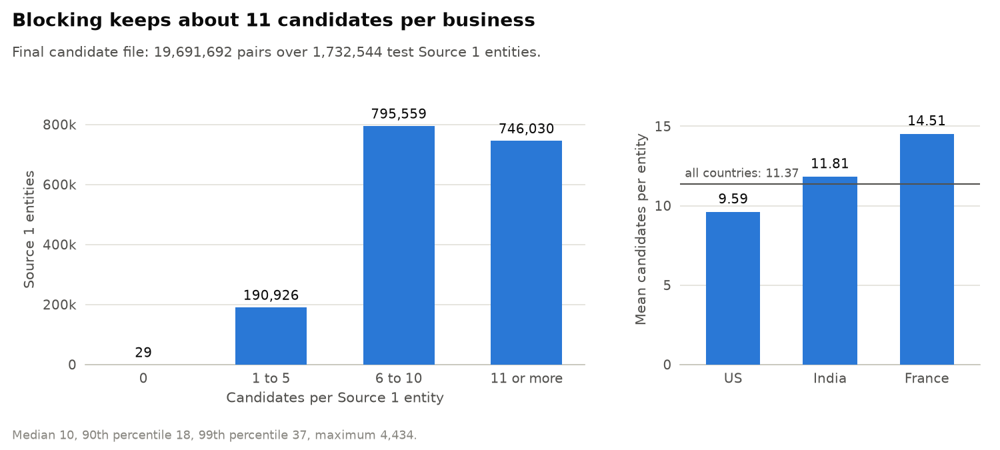
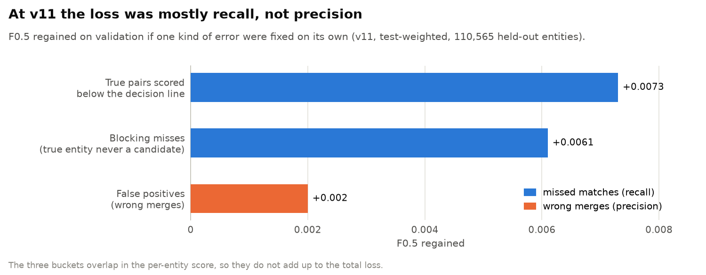
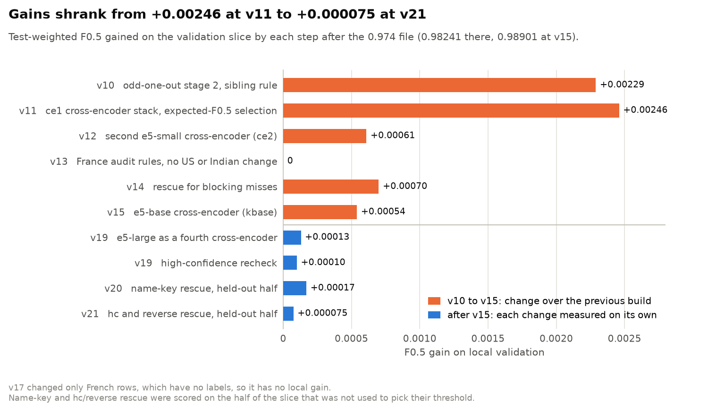

# 10. Leaderboard journey: v1 to v21

Team Inno8's public leaderboard score went from **0.940** on the first full-scale pipeline to **0.988642** on the final file. This page walks through the nine uploads with a recorded public score: what changed, what the leaderboard said, how that compared with our local validation, and what each step taught us.

The challenge ran from 25 Sep 2026 00:00 to 27 Sep 2026 23:59 IST. Our first commit landed at 03:41 on 26 Sep, about 28 hours into the window, so everything below happened in roughly the last 44 hours. All of it ran on an Apple M2 Mac (16 GB, MPS) plus free Kaggle GPUs (T4 and P100).


The method itself is covered in the deep dives on [the problem and the data](01-problem-and-data.md), [blocking](02-blocking.md), [the LightGBM stages](03-lightgbm-stages.md), [cross-encoders](04-cross-encoders.md), [decision rules](05-decision-rules.md), [rescue](07-rescue.md) and [validation](08-validation.md), with the full methodology in [methodology.md](methodology.md) and the run order in [reproduction.md](reproduction.md). This page is the story of how we got there.

## At a glance

| Upload | Main change | Public F0.5 | Change vs previous upload | Local validation |
| --- | --- | --- | --- | --- |
| v1 | Full-scale blocking and a stage 1 LightGBM | 0.940 | first upload | 0.9537 (older metric) |
| v2 | Cross and spaceless blocking keys, relative features, stage 2 | 0.950 | +0.010 | 0.9714 (older metric) |
| v3 | Learned transliteration map, legal-form and house-number features | 0.968 | +0.018 | 0.9817 (older metric) |
| v6 + veto | Learned decoy-word veto (the "0.974 file") | 0.974 | +0.006 | 0.98241 |
| v11 | Odd-one-out stage 2, first cross-encoder stack, expected-F0.5 selection | 0.982 | +0.008 | 0.98716 |
| v15 | Two more cross-encoders, France audit rules, rescue of blocking misses | 0.986784 | +0.004784 | 0.98901 |
| v17 | French address normalization fix and French re-run | 0.9871 | +0.000316 | 0.98901 (France has no labels) |
| v20 | e5-large in the stack, high-confidence recheck, France push, name-key rescue | 0.988549 | +0.001449 | +0.00013, +0.0001, +0.00017 (measured one at a time) |
| **v21 (final)** | hc and reverse rescue, 24 French empty-entity fills | **0.988642** | +0.000093 | +0.000075 (held-out half) |

"Local validation" is macro F0.5 on 110,565 held-out US and Indian Source 1 entities. From v6 on it is the **test-weighted** version described below; v1 to v3 were scored with an older, unweighted metric on a different held-out slice, so those three numbers are not comparable with the rest. Version numbers skip because many builds were only evaluated locally; the ones listed are the uploads with a recorded public score.

## Timeline

| Time (IST) | Event |
| --- | --- |
| 25 Sep, 00:00 | Challenge opens |
| 26 Sep, 03:41 | First team commit |
| 26 Sep, 20:32 | Full-scale pipeline and first validated submission committed (v1) |
| 27 Sep, 00:47 | v3 result recorded (0.968) |
| 27 Sep, early morning | 0.974 file (v6 + veto) on the board |
| 27 Sep, about 10:00 | v11 scores 0.982, 470th at the time |
| 27 Sep, 16:35 | v15 scores 0.986784 |
| 27 Sep, about 18:15 | v17 scores 0.9871, about 230th |
| 27 Sep, 18:19 | Leaderboard snapshot, 8,269 teams: 1st 0.991829, 50th 0.989515, 100th 0.988705 |
| 27 Sep, about 21:05 | v20 scores 0.988549, around 100th to 110th against the 18:19 snapshot |
| 27 Sep, 23:36 | v21 scores 0.988642, the final upload |
| 27 Sep, 23:59 | Challenge closes |

The public leaderboard is a guide. The final ranking comes from the private leaderboard, and it uses the **last** upload, which shaped how carefully the final file was gated.

## Phase 1: a full-scale pipeline on the board (v1 to v3)

The first job was simply to run end to end on the full data (1,732,544 test Source 1 businesses and 9,969,589 Source 2/3 records) on a 16 GB laptop. The core design never changed after v1: resolve from the Source 2/3 side, so that every record picks at most one Source 1 owner, and spend most of the effort on blocking recall.

### v1: 0.940

- **What changed.** Normalization, blocking from the Source 2/3 side with IDF-weighted rare keys (name and address unigrams and ordered bigrams, top 10 candidates per record), a stage 1 LightGBM on string-similarity features, and assignment of each record to its best candidate above a threshold.
- **Blocking.** The true entity was among the candidates for 94.45% of training pairs and ranked first for 88.8%.
- **Scores.** Local 0.9537 on the older metric; public 0.940.
- **Lesson.** The pipeline worked, but local and public disagreed by 0.0137. That gap turned out to be the most important signal of the whole challenge.

### v2: 0.950 (+0.010)

- **What changed.** Two new blocking key families: the core name with spaces removed ("wisedata" vs "wise data") and name token x address token cross keys (for example `primary|chelsea`). Relative features (each pair's gap to the record's best candidate). A second LightGBM stage that sees record and entity context. Threshold 0.75.
- **Blocking.** True entity kept for 97.05% of training pairs, ranked first for 94.4%.
- **Scores.** Stage 2 lifted the older local metric from 0.9664 to 0.9714; public 0.950.
- **Lesson.** The gap widened to 0.0214. Local was rewarding something the test did not.

### v3: 0.968 (+0.018)

- **What changed.** A transliteration dictionary learned from the training pairs (521 entries, for example `praivet` to private and `teknolojij` to technologies), a legal-form clash feature (Pvt vs LLC vs SARL mapped to shared codes) and house-number distance features. Threshold 0.80.
- **Blocking.** True entity kept for 98.2% of training pairs, ranked first for 96.2%. For transliterated Indian names, exact agreement of the core name with the true Source 1 name rose from 15.3% to 89.5%.
- **Scores.** Local 0.9817 on the older metric; public 0.968, the largest single jump of the challenge.
- **Lesson.** The gap was still 0.0137. We went looking for why, and found it in the data: test is more decoy-heavy than train. Train has 4.6765 Source 2/3 records per Source 1 entity and test has 5.7543. With the same 3.4613 true matches per entity, unmatched records per entity rise from 1.2153 to 2.2931, a factor of **1.887**, and about 39.8% of test Source 2/3 records match nothing against 26.0% in train. Unmatched records are mostly decoys, decoys are what cause wrong merges, and F0.5 weights wrong merges more heavily than misses.

The final candidate file is built on these keys. It holds about 11 candidates per business and leaves only 29 of the 1,732,544 test businesses without one ([blocking](02-blocking.md) has the details).



| Blocking version | True entity ranked first | True entity kept |
| --- | --- | --- |
| v1: unigram and ordered bigram keys, top 10 | 88.8% | 94.45% |
| v2: + spaceless-name and name x address cross keys | 94.4% | 97.05% |
| v3: + learned transliteration map | 96.2% | 98.2% |
| Final: + score-ratio pruning (at least 0.5 x best score) | 97.99% | 98.13% |

## Phase 2: fixing the measuring stick (v6 + veto, 0.974)

### v6 + veto: 0.974 (+0.006)

- **What changed.** A learned decoy-word veto. A word counts as a decoy word when records that match nothing added it to a real business name at least 200 times, while true pairs added it at most 0.2 times per 100 such uses. That gave 65 words for India (`public`, `industries`, `enterprises`, ...) and 27 for the US (`group`, `holdings`, `southside`, ...). A record whose name adds one of them to its candidate's name is not assigned. Threshold 0.75.
- **The new metric.** Every local number from here on is test-weighted: a false positive from a record with no true Source 1 entity counts with weight 1.887, matching the test's decoy density. On that metric the 0.974 file scores **0.98241**, and every later build is compared with it.
- **Scores.** Public 0.974. Gap 0.0084.

Two things we learned at this stage shaped everything after it.

1. **Synthetic duplicates leak.** v6's stage 2 had been trained with synthetic unmatched exact copies of records added as negatives. Only decoys ever had a perfect twin in that data, so the model learned "has a twin, so it is a decoy". Locally it looked like +0.003; measured without synthetic rows it was **-0.0017**. We removed it, and every later validation number is computed on data with no synthetic rows.
2. **Validation understated precision fixes.** An audit of the 0.974 file found that decoy words were 2.2 to 2.6 times more frequent among mid-score test pairs than among mid-score validation pairs (US 1.74% vs 0.68%, India 5.52% vs 2.54%). Locally the veto was worth +0.0006 to +0.0017 depending on the model underneath, far less than the +0.006 leaderboard step that came with it. Reweighting the metric was the correction for exactly this ([validation](08-validation.md) explains the weighting).

A typical decoy of the kind the veto and the later stages target copies a real business and changes one detail:

```
Source 1:  toledo womens health, 1781 hamilton st
Decoy:     toledo womens health, 1788 hamilton st              house number moved
Source 1:  Soutien Amicale SAS, 2 Rue Hans Christian Andersen
Decoy:     Soutien Amicale SNC, 9 Rue Hans Christian Andersen  legal form and number changed
```

## Phase 3: context and the first cross-encoder (v10 and v11)

### v10 (local only): 0.98470

- **What changed.** Stage 2 gained 28 "odd one out" features: for each record it looks at the other records that already point at the same Source 1 entity and asks whether this one is the outlier (a different house number, an extra word no sibling carries, a new suffix). A house-number sibling rule drops a low-confidence record whose house number disagrees with siblings that share the entity's number. For France: a guard (two stage 2 models must agree) and French exact-address additions.
- **Local gain.** +0.00229 over the 0.974 file. Not uploaded.

### v11: 0.982 (+0.008)

- **What changed.** The first cross-encoder: `intfloat/multilingual-e5-small`, fine-tuned on 250,000 training pairs on the M2 (4,013 seconds, 62 pairs per second), reading the record and its candidate together as `name | address` text. It only re-reads the **uncertain band**: pairs ranked first or second for their record with a stage 2 score in [0.01, 0.99], 902,470 of the 19.2M test candidates. A small LightGBM stacker combines its score with stage 1 and stage 2. The decision also changed: instead of one global threshold, each Source 1 entity keeps the set of records that maximises its expected F0.5.
- **Scores.** Local 0.98716 (+0.00246 over v10, +0.00475 over the 0.974 file). Public 0.982, 470th when it was scored.
- **Lesson.** The leaderboard gained more (+0.008) than local validation (+0.00475). The cross-encoder appears to help most on decoy-shaped pairs, and the test has more of them. The gap fell from 0.0084 to 0.0052.

### Where the v11 loss sat

Before choosing the next steps we split the remaining v11 loss on validation into three kinds of error and measured how much F0.5 each would give back if it were fixed on its own.



Recall dominated: true pairs scored below the decision line (0.0073) and blocking misses (0.0061) each outweighed all false positives together (0.002). The buckets overlap in the per-entity score, so they do not add up to the total loss. This decomposition decided the rest of the challenge:

| Bucket at v11 | F0.5 regained if fixed | Steps aimed at it | Measured local gain |
| --- | --- | --- | --- |
| True pairs below the decision line | 0.0073 | ce2 (v12), kbase (v15), klarge (v19) | +0.00061, +0.00054, +0.00013 |
| Blocking misses | 0.0061 | rescue (v14), name-key rescue (v20), hc and reverse rescue (v21) | +0.00070, +0.00017, +0.000075 |
| False positives | 0.002 | high-confidence recheck (v19); France push (v19, not measurable locally) | +0.0001 |

## Phase 4: ensemble, France rules and rescue (v12 to v15)

Uploads were scarce by now, so three builds were judged only locally before the next upload.

| Build | Change | Local F0.5 | Gain |
| --- | --- | --- | --- |
| 0.974 file | baseline | 0.98241 | |
| v10 | odd-one-out stage 2, sibling rule | 0.98470 | +0.00229 |
| v11 | ce1 stack, expected-F0.5 selection | 0.98716 | +0.00246 |
| v12 | ce2: ce1 trained further on the next 500,000 pairs (7,324 s on the M2) | 0.98777 | +0.00061 |
| v13 | France audit rules (US and India unchanged) | 0.98777 | 0 |
| v14 | rescue for blocking misses | 0.98847 | +0.00070 |
| v15 | kbase: `multilingual-e5-base` on a free Kaggle T4 | 0.98901 | +0.00054 |

- **France audit rules (v13).** France is 15% of test and has no labels at all, so its rules came from an audit of French test pairs checked with label-free evidence. Computed on the v11 inputs they removed 15,479 pairs (15,088 of them type-word swaps, where a record replaces the business-type word of the real name) and added 23,928 pairs the guard had blocked. Applied to v15 they removed 14,970 matches and added 22,365. None of this moves the US/India validation number.
- **Rescue (v14).** Records left unassigned get a second, independent candidate search with six key families: exact sorted address, spaceless name plus house number, glued or split name words, one-letter typos in rare name words, house number plus address word, and pairs of address words. ce1 and ce2 score each candidate and a small LightGBM acceptance model (out-of-fold AUC 0.9984) decides at 0.7. On validation it adds 1,095 records, 1,033 of them correct. On test it added 12,451 records (India 7,410, US 5,041).
- **kbase (v15).** `multilingual-e5-base`, all weights trainable, one epoch over 1,392,272 pairs on a free Kaggle T4 (10,878 steps at 245 pairs per second).

### v15: 0.986784 (+0.004784)

- **Scores.** Local 0.98901; public 0.986784. The gap shrank from 0.0052 to 0.0022.
- **Lesson.** The leaderboard again moved more than local validation (+0.004784 against +0.00185). Much of the difference is likely France: the audit rules are invisible to local validation, and the gap to the board closed right after they went in.

### Why a weaker model still helps

No cross-encoder ever beat stage 2 on its own, yet every one we kept raised the stacked AUC, because they are wrong on different pairs than the gradient-boosted model ([cross-encoders](04-cross-encoders.md) covers training and stacking).


| Scorer on the 82,133 validation band pairs | AUC alone | Stacked with stage 2 and the rows above (out of fold) |
| --- | --- | --- |
| Stage 1 LightGBM | 0.9415 | |
| Stage 2 LightGBM | 0.9714 | 0.9714 |
| ce1 (e5-small, 250k pairs) | 0.9269 | 0.9777 |
| ce2 (e5-small, +500k pairs) | 0.9457 | 0.9807 |
| kbase (e5-base, 1.39M pairs) | 0.9591 | 0.9828 |
| klarge (e5-large, 900k pairs, added in v19) | 0.9600 | 0.9834 |
| ce3 (e5-small, remaining 642,272 pairs, dropped) | 0.9525 | 0.9830 instead of 0.9828 on top of kbase, no F0.5 gain |

## Phase 5: France without labels (v17)

### v17: 0.9871 (+0.000316)

- **What changed.** The address normalization had been built for US and Indian formats and handled French ones badly. Four French-only fixes: drop region and department names, drop the `N°` sign, split number suffixes (`5B` to `5 bis`, `19BIS` to `19 bis`) and map French street abbreviations to one form. They change 1,233,001 of the 1,694,445 French test addresses and leave every US and Indian record untouched.

  ```
  record:   N°56 AVENUE DE VILLENEUVE, SAINT-NAZAIRE, Pays de la Loire
  before:   ndeg56 ave de villeneuve st nazaire pays de la loire
  after:    56 ave de villeneuve st nazaire
  ```

  French records were then re-run through blocking, both stages, the guard and the decision with the v15 models, and filtered against v15: 1,112 new pairs whose house number or street differs were dropped, and 1,427 v15 pairs the re-run had lost were put back. The result has 856,341 French pairs; against v15, 14,700 were added and 3,630 removed.
- **Audit.** We hand-read 30 random pairs per group on the raw test text. Pairs only in the new run: 25 same business, 3 different, 2 unsure. Pairs only in v15: 11 same, 17 different, 2 unsure.
- **Expected effect.** France cannot be scored locally, so the effect was modelled with a Monte Carlo over the affected entities: +0.00106 central, +0.00054 pessimistic, +0.00020 worst case.
- **Scores.** Public 0.9871, about 230th at the 18:19 snapshot.
- **Lesson.** The measured gain (+0.000316) landed between the pessimistic and worst-case scenarios, about a third of the central estimate. Label-free modelling got the direction right and the size wrong, so from here on every French change was held to hand-read samples and fingerprints, and kept small.

## Phase 6: the final evening (v19 to v21)

After v17 the team had two uploads left, and the private ranking would use the last one. Every late change therefore had to pass a gate that was run separately from the code that produced it: a held-out gain for US and India, and hand reads plus fingerprints for France.

### v19 (local only)

| Change | What it does | Evidence |
| --- | --- | --- |
| klarge | `multilingual-e5-large` on a free Kaggle T4 (frozen word embeddings, batch 32, 900,000 pairs) joins the stack as a fourth cross-encoder | +0.00013 local; band AUC 0.9600 alone, 0.9834 stacked |
| High-confidence recheck | 429,125 US and Indian top-1 pairs with a stage 2 score in (0.99, 0.999] are rescored by ce1, ce2 and a stacker; each keeps the lower score, so the recheck can only remove | +0.0001 local |
| France push, removals | A French-adapted cross-encoder flags type-word-swap decoys; 922 removed after the gate | 20 of 20 random removals were decoys; a fresh 20 gave 18 decoys, 1 typo copy, 1 unsure |
| France push, additions | Domain-style and run-together French names at the same address; 2,248 added after the gate | 20 of 20 random additions correct; a fresh 20 gave 19 of 20 |

### v20: 0.988549 (+0.001449)

- **What changed.** v19 plus name-key rescue for US and Indian records that have no address and no useful blocking candidate: keys built from sorted name words, with one word deleted or reduced to its initial, used only when at most 3 Source 1 entities share the key. It adds 3,169 test records.
- **Evidence.** The threshold was picked on one half of the validation slice and scored on the other: +0.000166 on the evaluation half, +0.000143 on the fitting half.
- **Scores.** Public 0.988549, around 100th to 110th against the 18:19 snapshot and above our 0.9877 to 0.9882 estimate.
- **Lesson.** The v17 to v20 jump (+0.001449) was more than three times the sum of the US/India increments measured locally (+0.0004). Part of that is the usual pattern of the board rewarding precision changes more than validation does, and part is probably the France push; the two cannot be separated.

### v21: 0.988642 (+0.000093)

- **What changed.** Two more rescue searches for US and Indian records that were still unassigned: *hc* for records whose existing candidates all score below 0.3 (2,252 additions) and *reverse blocking* from the Source 1 side (563 additions, 324 of which hc already adds), 2,491 records in total. Plus 24 strict French pairs for French Source 1 entities that would otherwise stay empty.
- **Evidence.** +0.000075 on held-out halves, positive in all four quarters of the slice. The French fill touches 20 Source 1 entities, so its expected effect is below +0.00002.
- **Scores.** Predicted about +0.00008; measured +0.000093. Final public score **0.988642**, just below the 100th-placed score in the 18:19 snapshot (0.988705).
- **What we did not upload.** A fifth cross-encoder, `BAAI/bge-reranker-v2-m3` fine-tuned on a Kaggle P100, scored 0.98841 locally with five cross-encoders against 0.98844 with four, so v21 stayed the final file.



## Local validation vs the leaderboard


| Upload | Local | Public | Local minus public |
| --- | --- | --- | --- |
| v1 | 0.9537 (older metric) | 0.940 | 0.0137 |
| v2 | 0.9714 (older metric) | 0.950 | 0.0214 |
| v3 | 0.9817 (older metric) | 0.968 | 0.0137 |
| v6 + veto | 0.98241 | 0.974 | 0.0084 |
| v11 | 0.98716 | 0.982 | 0.0052 |
| v15 | 0.98901 | 0.986784 | 0.0022 |
| v17 | 0.98901 | 0.9871 | 0.0019 |

How well did each step's predicted gain match the leaderboard?

| Step | Predicted | Measured on the leaderboard | Reading |
| --- | --- | --- | --- |
| 0.974 file to v11 | +0.00475 local | +0.008 | Leaderboard gained more: the cross-encoder helps most on decoy-heavy test pairs |
| v11 to v15 | +0.00185 local (US and India only) | +0.004784 | Leaderboard gained more: the France audit rules are invisible locally |
| v15 to v17 | +0.00106 modelled (+0.00054 pessimistic, +0.00020 worst case) | +0.000316 | About a third of the central estimate |
| v17 to v20 | 0.9877 to 0.9882 estimated | 0.988549 | Above the estimate |
| v20 to v21 | about +0.00008 held-out | +0.000093 | Close match |

The pattern is the main lesson of the challenge. Early on, local validation overstated the score by up to 0.0214 because it did not see the test's decoy density. Once the metric was reweighted, the gap closed step by step, and by the end a held-out gain of +0.00008 predicted a leaderboard gain of +0.000093.

## What we learned

1. **Measure what the test measures.** The single most useful number of the challenge was 1.887, the ratio of unmatched records per entity between test and train. Reweighting false positives by it is what made local gains and leaderboard gains move together.
2. **Never train on synthetic exact duplicates.** A model will learn whatever separates synthetic rows from real ones. Our twin copies looked like +0.003 and were really -0.0017.
3. **Spend the expensive model only where it matters.** The cross-encoders read 902,470 uncertain pairs, not 19.2M candidates, which is what made them affordable on a laptop and free Kaggle GPUs.
4. **A weaker model can still lift a stack.** Every cross-encoder scored below stage 2 alone, and every one we kept still raised the stacked AUC, from 0.9714 to 0.9834.
5. **Recall was the bottleneck, and blocking is its ceiling.** At v11, missed matches were worth several times the false positives. Rescue passes, name keys and reverse blocking together recovered part of the blocking misses.
6. **Without labels, be conservative and read the data.** France changes were gated by hand-read samples and label-free fingerprints, and the one French change we could model still came in at about a third of its central estimate.
7. **Late gains need honest error bars.** With the last upload deciding the private ranking, the final changes were scored on the half of the slice that did not pick their thresholds, and the last prediction (+0.00008) and result (+0.000093) agreed closely.

## What did not make it

| Idea | Result |
| --- | --- |
| Synthetic exact-duplicate decoys in stage 2 training | +0.003 locally, -0.0017 once measured cleanly (a leak) |
| Per-country quantile normalization of scores | No gain |
| Self-training on confident predictions | No gain |
| A 95-feature stacker instead of 8 features | +0.00004 once the cross-encoders were in |
| A third e5-small cross-encoder (ce3) | Stacked AUC 0.9828 to 0.9830, no F0.5 gain |
| Re-tuning the decision settings on a grid | No held-out gain of at least +0.00005 |
| Broader French change sets (3,952 removals, 62 empty-entity fills) | Failed their audits |
| A fifth cross-encoder (bge-reranker-v2-m3) | 0.98841 with five against 0.98844 with four |
| "Orphan copies" as the cause of the leaderboard gap | Rejected: the address-less rate of test records matches decoys, not copies |

The largest loss that remains is address-less records whose name is shared by many businesses, such as branches of a chain: about 0.005 of local F0.5, with no signal in the data that separates the branches.

## What the final file looks like

| File | Matched Source 2/3 records | Empty Source 1 entities | Candidate pairs |
| --- | --- | --- | --- |
| v15 | 5,817,948 | 100,309 | 19,246,911 |
| v17 | 5,829,018 | 100,036 | 19,250,779 |
| v21 (final) | 5,833,349 | 99,991 | 19,691,692 |

All three pass the official validator. The v21 candidate file is exactly the set of pairs the final models scored, and every submitted match is in it.

## Reproducing the charts

Every chart on this page is drawn from hard-coded numbers by [`research/make_figures.py`](../research/make_figures.py):

```bash
python research/make_figures.py
```

It writes the PNGs to [`assets/`](../assets) and regenerates them exactly.
